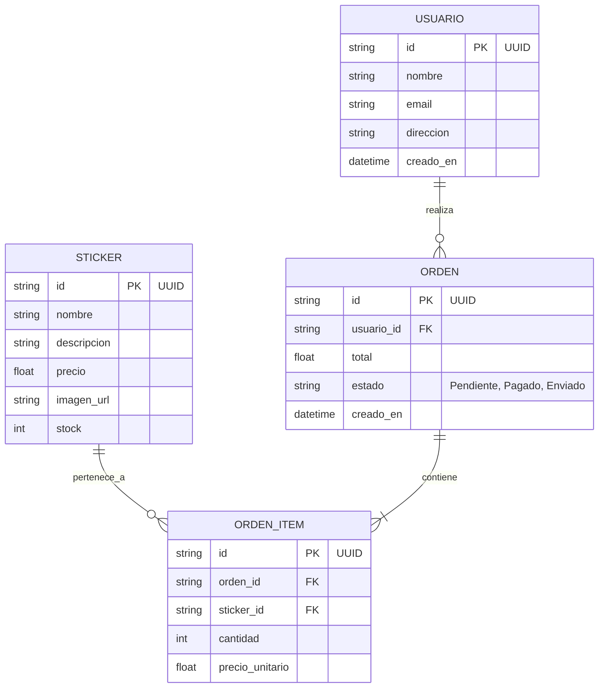

# Análisis del Proyecto MVP: "StickerBomb" - Stickers para Tarjetas

> [!NOTE]  
> Este documento contiene el análisis, la arquitectura y el plan de desarrollo para el MVP de la tienda de stickers adhesivos para tarjetas de crédito/débito.

## 1. Visión General del Proyecto
Crear un Minimum Viable Product (MVP) para una plataforma de comercio electrónico especializada en la venta de stickers decorativos para tarjetas de crédito y débito. La plataforma debe ofrecer una experiencia premium, rápida y segura, permitiendo a los usuarios navegar, comprar y hacer seguimiento de sus pedidos.

## 2. Características Principales del MVP

| Característica | Descripción | Prioridad |
| :--- | :--- | :--- |
| **Catálogo de Stickers** | Galería visual con filtros (categorías, colecciones). Cada sticker tendrá detalles, precio y botón de agregar al carrito. | 🔴 Alta |
| **Visor de Previsualización (Simulador)** | Sección interactiva donde el usuario escoge un diseño y lo visualiza aplicado sobre la silueta de una tarjeta (con recorte de chip) simulando el resultado real. | 🔴 Alta |
| **Carrito de Compras** | Gestión temporal de productos seleccionados, cálculo de subtotales, impuestos y total. | 🔴 Alta |
| **Registro/Login de Usuarios** | Autenticación para guardar datos de envío y facturación de forma segura. | 🔴 Alta |
| **Gestión de Órdenes** | Historial de compras para el usuario y visualización del estado del pedido (Pendiente, Procesando, Enviado). | 🔴 Alta |
| **Checkout Básico** | Formulario para ingresar dirección de envío e integración simulada o básica de pasarela de pago. | 🟡 Media |

## 3. Arquitectura y Stack Tecnológico Recomendado

> [!TIP]  
> Para un MVP moderno, escalable y con una estética visual impresionante, se recomienda utilizar un stack moderno y ágil basado en Javascript/React.

* **Frontend:** React (usando Vite o Next.js). Recomiendo **Next.js** por su sistema de enrutado simple y capacidad de hacer llamadas seguras a bases de datos desde el lado del servidor si es necesario.
* **Estilos:** Vanilla CSS moderno (Variables CSS, Grid, Flexbox) para control total de la estética "Glassmorphism" y animaciones fluidas sin depender de librerías pesadas.
* **Backend y Base de Datos:** **Supabase** o **Firebase**. Son plataformas "Backend-as-a-Service" ideales para MVPs. Proveen autenticación, base de datos relacional/NoSQL y almacenamiento de imágenes listas para usar.
* **Pagos (Fase de Checkout):** Integración en modo test de una pasarela como Stripe.

## 4. Diseño Preliminar de Base de Datos

## 5. Diseño y Estética (UI/UX)
Para cumplir con un estándar de diseño web impresionante y premium:
* **Tema Visual:** Diseño tipo "Dark Mode" elegante o colores de alto contraste que hagan resaltar el arte de los stickers.
* **Simulador de Stickers:** Interfaz interactiva y dinámica donde el diseño seleccionado toma la forma de una tarjeta de crédito/débito virtual en tiempo real.
* **Interacciones Dinámicas:** Efectos hover suaves en los productos, transiciones al abrir el carrito y micro-animaciones en los botones.
* **Tipografía:** Fuentes limpias y modernas (ej. Inter, Outfit o Roboto) importadas desde Google Fonts.

## 6. Roadmap de Desarrollo

1. **Fase 1: Estructura Base:** Inicialización del framework (Next.js/Vite), configuración de estilos globales y tokens de diseño CSS.
2. **Fase 2: Base de Datos y Auth:** Configuración del proyecto en la base de datos (ej. Supabase) y creación de las pantallas de Login/Registro.
3. **Fase 3: UI Principal y Simulador:** Desarrollo del catálogo de stickers y el Visor de Previsualización interactivo con las siluetas de tarjetas.
4. **Fase 4: Lógica de Compra:** Implementación del estado global del carrito de compras.
5. **Fase 5: Checkout y Panel de Usuario:** Funcionalidad para crear la orden en la base de datos y vista para que el usuario pueda ver sus órdenes pasadas y su estado.

> [!IMPORTANT]  
> Revisa la propuesta técnica y la base de datos. Si estás de acuerdo, podemos comenzar con la Fase 1 creando el esqueleto del proyecto en tu espacio de trabajo.
